# Hello, I'm Samuel Usikpedo 👋

## Frontend Developer | Software Engineer | Tech Enthusiast | IT Specialist

I'm passionate about building intuitive, responsive web and mobile applications. With expertise in frontend development using React and Next.js, I also create mobile applications React Native. I'm always eager to learn new technologies, solve complex problems, and contribute to open-source projects.

- 💬 Ask me about: React, Next.js, Typescript
- 📫 How to reach me: usikpedosamuel@gmail.com
- ⚡ Fun fact: I love fun

## 🛠️ Technologies & Tools

### **Frontend Development**

### **Mobile App Development**

### **Tools & Testing**

## 📈 GitHub Stats

## ⌨️ Coding Activity

